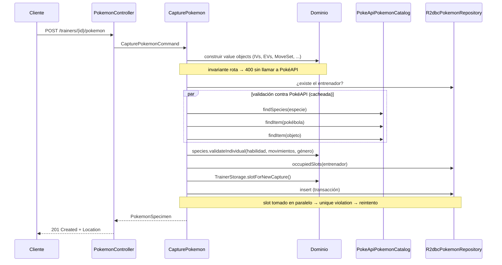

# pokemon-trainer-service

Servicio para gestionar los **Pokémon individuales de cada entrenador**, separando el **Equipo Activo** del **Baúl (PC Box)**. Está construido sobre el proyecto heredado [`pokeapi-reactor`](https://github.com/SirSkaro/pokeapi-reactor), un cliente reactivo de [PokéAPI](https://pokeapi.co/).

> Resolución del desafío técnico *"Baúl de Pokémon y Equipo Activo"*. Este README reemplaza al original de la librería: describe qué se hizo, por qué y cómo usar y mantener el proyecto. La documentación original de la librería está resumida en [La librería heredada](#la-librería-heredada-pokeapi-reactor).

## Contenido

- [Qué hace](#qué-hace)
- [Cómo correrlo](#cómo-correrlo)
- [API](#api)
- [Arquitectura](#arquitectura)
- [Modelo de dominio y reglas](#modelo-de-dominio-y-reglas)
- [Persistencia](#persistencia)
- [Integración con PokéAPI](#integración-con-pokéapi)
- [Decisiones y alternativas](#decisiones-y-alternativas)
- [Cambios y hallazgos en la librería heredada](#cambios-y-hallazgos-en-la-librería-heredada)
- [Tests](#tests)
- [Guía de mantenimiento](#guía-de-mantenimiento)
- [Evolución propuesta](#evolución-propuesta)
- [Herramientas utilizadas](#herramientas-utilizadas)

---

## Qué hace

- **Captura** de Pokémon con sus datos individuales: IVs, EVs, naturaleza, habilidad, género, variocolor, movimientos, objeto equipado y datos de origen. Cada ejemplar se valida contra PokéAPI y se asigna **automáticamente** al primer lugar libre del equipo o, si el equipo está lleno, al baúl.
- **Detalle** de un ejemplar con toda su metadata técnica, genética y de origen.
- **Equipo activo** como **vista compuesta**: los datos del ejemplar se combinan con los datos de la especie en PokéAPI (tipos, stats base, sprite) y con las **stats calculadas** con la fórmula oficial de los juegos.
- **Baúl** paginado.
- **Traslado** entre equipo y baúl, con validación de límites.
- **Evolución** (bonus): valida que la especie destino sea una evolución **directa**, incluyendo líneas ramificadas como Eevee. Reasigna la habilidad y conserva identidad, genética, objeto, historial y **el slot exacto** en el equipo.

## Cómo correrlo

Requisitos: **Java 17**, **Maven 3.9+** y **Docker** (para Postgres y los tests de integración).

```bash
docker compose up -d                 # Postgres 16 en localhost:5432
mvn spring-boot:run                  # la app en http://localhost:8080
```

| Recurso | URL |
|---|---|
| Swagger UI | http://localhost:8080/swagger-ui.html |
| OpenAPI (JSON) | http://localhost:8080/v3/api-docs |
| Health | http://localhost:8080/actuator/health |

Flyway crea el esquema al arrancar. La configuración está en [`application.yml`](src/main/resources/application.yml) y se puede sobreescribir con variables de entorno:

| Variable / propiedad | Default | Descripción |
|---|---|---|
| `DB_R2DBC_URL` | `r2dbc:postgresql://localhost:5432/pokestorage` | Conexión reactiva de la app |
| `DB_JDBC_URL` | `jdbc:postgresql://localhost:5432/pokestorage` | Conexión JDBC, solo para migraciones de Flyway |
| `DB_USER` / `DB_PASSWORD` | `pokestorage` | Credenciales |
| `POKEAPI_BASE_URI` | `https://pokeapi.co/api/v2/` | Instancia de PokéAPI |
| `pokestorage.storage.team-capacity` | `6` | Máximo de Pokémon en el equipo activo |
| `pokestorage.storage.box-capacity` | `30` | Máximo de Pokémon en el baúl |
| `pokestorage.pokeapi.connect-timeout` / `response-timeout` | `2s` / `5s` | Timeouts HTTP hacia PokéAPI |
| `spring.cache.caffeine.spec` | `maximumSize=2000,expireAfterWrite=24h` | Caché de recursos de PokéAPI |

## API

Base: `/api/v1`. Todos los errores siguen **RFC 7807** (`application/problem+json`) e incluyen un `code` estable, pensado para que los clientes no tengan que parsear mensajes.

| Método | Ruta | Descripción | Éxito |
|---|---|---|---|
| `POST` | `/trainers` | Registrar entrenador | `201` + `Location` |
| `GET` | `/trainers/{trainerId}` | Consultar entrenador | `200` |
| `POST` | `/trainers/{trainerId}/pokemon` | Capturar / crear ejemplar (va al equipo o al baúl) | `201` + `Location` |
| `GET` | `/trainers/{trainerId}/pokemon/{pokemonId}` | Detalle del ejemplar | `200` |
| `GET` | `/trainers/{trainerId}/team` | Equipo activo (vista compuesta con PokéAPI) | `200` |
| `GET` | `/trainers/{trainerId}/box?page=0&size=30` | Baúl paginado | `200` |
| `PUT` | `/trainers/{trainerId}/pokemon/{pokemonId}/storage` | Mover entre `TEAM` y `BOX` (idempotente) | `200` |
| `POST` | `/trainers/{trainerId}/pokemon/{pokemonId}/evolution` | Evolucionar un miembro del equipo | `200` |

### Errores

| HTTP | `code` | Cuándo |
|---|---|---|
| 400 | `invalid-value` | Viola una invariante: IV fuera de 0–31, EV > 252 o total > 510, más de 4 movimientos, nivel fuera de 1–100, etc. |
| 400 | *(Spring)* | JSON inválido, campo obligatorio ausente, enum o UUID inválidos |
| 404 | `not-found` | Entrenador o ejemplar inexistente (o de otro entrenador) |
| 409 | `storage-full` | Equipo o baúl lleno (`area` indica cuál) |
| 409 | `pokemon-not-in-team` | Se intenta evolucionar un Pokémon que está en el baúl |
| 409 | `concurrent-modification` | Contención extrema sobre el mismo slot; se puede reintentar |
| 422 | `species-rule-violation` | Habilidad, movimiento o género incompatible con la especie. Incluye `violations` con **todas** las infracciones |
| 422 | `unknown-pokeapi-entry` | Especie u objeto inexistente en PokéAPI |
| 422 | `invalid-item` | La Pokébola indicada no es una Pokébola |
| 422 | `evolution-not-allowed` | La especie destino no es evolución directa |
| 503 | `pokeapi-unavailable` | PokéAPI no responde (después de los reintentos) |

### Ejemplos

```bash
# Registrar entrenador
curl -s -X POST localhost:8080/api/v1/trainers -H 'Content-Type: application/json' -d '{"name":"Ash"}'

# Capturar un Pikachu
curl -s -X POST localhost:8080/api/v1/trainers/$TRAINER/pokemon -H 'Content-Type: application/json' -d '{
  "species": "pikachu",
  "nickname": "Sparky",
  "level": 25,
  "individualValues": {"hp":31,"attack":31,"defense":31,"specialAttack":31,"specialDefense":31,"speed":31},
  "effortValues":     {"hp":4,"attack":0,"defense":0,"specialAttack":252,"specialDefense":0,"speed":252},
  "nature": "TIMID",
  "ability": "static",
  "gender": "FEMALE",
  "shiny": true,
  "moves": ["thunderbolt", "quick-attack"],
  "heldItem": "light-ball",
  "origin": {"pokeball": "poke-ball", "location": "viridian-forest"}
}'
```

Opcionales: `nickname`, `effortValues` (default: todo en 0), `heldItem`, `origin.originalTrainerId` (default: el entrenador que captura), `origin.caughtAt` (default: ahora). El nivel de captura queda registrado como `origin.metLevel`.

```bash
# Equipo activo (vista compuesta)
curl -s localhost:8080/api/v1/trainers/$TRAINER/team
# {"capacity":6,"members":[{"slot":1,
#    "pokemon":{...detalle del ejemplar...},
#    "species":{"id":25,"name":"pikachu","types":["electric"],"baseStats":{...},"spriteUrl":"..."},
#    "stats":{"hp":60,"attack":36,"defense":32,"specialAttack":53,"specialDefense":37,"speed":80}}]}

# Depositar en el baúl / retirar al equipo
curl -s -X PUT localhost:8080/api/v1/trainers/$TRAINER/pokemon/$POKEMON/storage -H 'Content-Type: application/json' -d '{"area":"BOX"}'

# Evolucionar (ability es opcional)
curl -s -X POST localhost:8080/api/v1/trainers/$TRAINER/pokemon/$POKEMON/evolution -H 'Content-Type: application/json' -d '{"targetSpecies":"gyarados"}'
```

Los nombres de especies, habilidades, movimientos y objetos son los de PokéAPI (minúsculas con guiones). La entrada se normaliza: `"Pikachu"` equivale a `"pikachu"`.

## Arquitectura

Monolito modular de **un solo módulo Maven**, organizado en capas con dependencias que **solo apuntan hacia adentro**. [ArchUnit](src/test/java/com/betwarrior/pokestorage/architecture/ArchitectureTest.java) verifica esas reglas en cada build: si alguien las rompe, falla el build.


| Paquete | Responsabilidad | Puede depender de |
|---|---|---|
| `domain` | Reglas del negocio: value objects, ejemplar, almacenamiento, especie, evolución, fórmula de stats | nada (sin Spring, Reactor ni la librería) |
| `application` | Casos de uso (`CapturePokemon`, `ListTeam`, `TransferPokemon`, `EvolvePokemon`, …) e interfaces que necesitan (`PokemonRepository`, `TrainerRepository`, `PokemonCatalog`) | `domain` |
| `infrastructure.persistence` | Implementación R2DBC de los repositorios | `application`, `domain` |
| `infrastructure.pokeapi` | `PokeApiPokemonCatalog`: traduce recursos de PokéAPI al dominio | `application`, `domain`, librería |
| `web` | HTTP: payloads, validación de formato y mapeo de errores | `application`, `domain` |
| `skaro.pokeapi` | Librería heredada (cliente de PokéAPI) | solo la usa `infrastructure.pokeapi` |

**Por qué este estilo.** La librería heredada expone un modelo anémico, en *snake_case* y con bugs. El dominio no la conoce: si mañana se reemplaza por otro cliente, o por una copia local de los datos, solo cambia `infrastructure.pokeapi`. Además, cada capa tiene una responsabilidad clara, lo que facilita incorporar gente nueva.

### Flujo de captura



## Modelo de dominio y reglas

| Concepto | Clase | Regla |
|---|---|---|
| Ejemplar | `PokemonSpecimen` | Inmutable; identidad por `PokemonId` (UUID) |
| Valores Individuales | `IndividualValues` | 6 stats, cada una entre **0 y 31** |
| Valores de Esfuerzo | `EffortValues` | Cada stat entre **0 y 252**, total **≤ 510** |
| Naturaleza | `Nature` | Las **25**, cada una con la stat que sube y la que baja un 10%. Las 5 neutras no modifican nada y el HP nunca se ve afectado |
| Habilidad | `Species.validateIndividual` | Debe ser una de las que la especie tiene en PokéAPI (incluye ocultas) |
| Movimientos | `MoveSet` | Entre **1 y 4**, sin repetidos, y aprendibles por la especie según PokéAPI |
| Género | `Gender` + `GenderRatio` | `MALE` / `FEMALE` / `GENDERLESS`, compatible con el `gender_rate` de la especie: sin género → solo `GENDERLESS`; 100% machos → solo `MALE`; etc. |
| Variocolor | `shiny` | Flag |
| Origen | `CaptureOrigin` | OT, Pokébola (debe ser de una categoría `*-balls` en PokéAPI), fecha, nivel inicial y ubicación |
| Objeto equipado | `heldItem` | Como máximo uno; debe existir en PokéAPI |
| Almacenamiento | `TrainerStorage` + `StorageSlot` | Captura: primer slot libre del equipo, si no del baúl, si no `409`. Los slots **no se compactan**: el Pokémon conserva su posición exacta |
| Stats calculadas | `StatCalculator` | Fórmula oficial (Gen III+), validada con el ejemplo de referencia de Garchomp nivel 78 |
| Evolución | `PokemonSpecimen.evolveInto` | Solo en equipo; destino = evolución **directa**; conserva todo salvo especie y habilidad |

**Interpretación del enunciado.** El PDF dice que las stats "arrancan desde 1" y que se les suman "valores de genética" de 0 a 31. Lo modelé como en los juegos: las **stats base** (≥ 1) vienen de PokéAPI según la especie, y los **IVs** (0–31) son la genética propia de cada ejemplar. La stat final combina base, IVs, EVs, nivel y naturaleza, y se expone en la vista del equipo.

### Evolución

- **Validación de línea directa:** una especie destino es válida si en PokéAPI su `evolves_from_species` es la especie actual. Con eso alcanza para líneas simples (Bulbasaur → Ivysaur → Venusaur, sin saltar etapas) y ramificadas (Eevee → Vaporeon, Jolteon, …), con un solo recurso por especie y sin recorrer el árbol de `EvolutionChain`.
- **Habilidad:** si el request la especifica, debe pertenecer a la especie destino. Si no, se mantiene el **mismo slot de habilidad** que tenía (una habilidad oculta pasa a la oculta de la evolución) y, si ese slot no existe, se usa la primera no oculta. Ejemplo: Magikarp *swift-swim* (slot 1) → Gyarados *intimidate* (slot 1).
- No se validan requisitos situacionales (nivel, objetos, amistad), como indica el enunciado.

## Persistencia

PostgreSQL 16 con acceso **reactivo (R2DBC)**, coherente con WebFlux y con la librería. El esquema se versiona con **Flyway** en [`V1__create_trainer_storage.sql`](src/main/resources/db/migration/V1__create_trainer_storage.sql).

- Dos tablas: `trainer` y `pokemon`. Los atributos del ejemplar son **columnas planas** (`iv_hp`, `ev_speed`, `nature`, …), consultables e indexables. Los movimientos van en un `varchar[]`.
- **La base de datos también protege las invariantes** con `CHECK` (rangos de IV/EV, total de EVs ≤ 510, 1–4 movimientos, nivel 1–100), por si alguien escribe por fuera de la app.
- **Concurrencia:** `UNIQUE (trainer_id, storage_area, storage_slot)`. Si dos capturas simultáneas eligen el mismo slot libre, la base rechaza una; la aplicación la reintenta releyendo el almacenamiento. Como el dominio solo asigna slots entre 1 y la capacidad, **nunca se supera el límite**. Hay un test de integración que dispara 20 capturas concurrentes contra un límite de 8.
- Los repositorios usan `DatabaseClient` con SQL explícito, sin Spring Data: el mapeo es visible y no hay magia.

## Integración con PokéAPI

`PokeApiPokemonCatalog` usa el `PokeApiClient` heredado, en su configuración **con caché**:

- **Especie:** `pokemon-species/{name}` → variedad por defecto → `pokemon/{id}` para habilidades, movimientos, stats, tipos y sprite. Resolver la variedad por defecto hace que especies como `deoxys` funcionen (su Pokémon por defecto es `deoxys-normal`).
- **Caché:** Caffeine a través del `CacheManager` de Spring (24 h, 2000 entradas). Los datos de PokéAPI son prácticamente estáticos, así que la vista del equipo casi no genera tráfico.
- **Resiliencia:**
  - Timeouts de conexión y respuesta.
  - Hasta 2 reintentos con backoff, **solo** ante errores transitorios (5xx, I/O, timeout).
  - Un 404 se traduce en "no existe" (422) y no se reintenta.
  - Si PokéAPI sigue sin responder después de los reintentos, se devuelve `503`.

## Decisiones y alternativas

| Decisión | Alternativas evaluadas | Por qué |
|---|---|---|
| Spring Boot 3.5 + Java 17 ([ADR 0001](docs/adr/0001-migracion-spring-boot-3.md)) | Quedarse en 2.4.3; 2.7; 4.1 | 2.x sin soporte. 4.1 implica Jackson 3, del que la librería depende mucho. 3.5 da Java 17, `jakarta` y `ProblemDetail` con un riesgo acotado |
| Un solo módulo con capas + ArchUnit | Multi-módulo Maven; JPMS | Menos ceremonia. ArchUnit da una garantía parecida a la de módulos separados |
| WebFlux + R2DBC | Spring MVC + JPA | La librería es reactiva; mezclar modelos bloqueantes y reactivos agrega complejidad y riesgo de bloquear el event loop |
| Columnas planas | JSONB con toda la genética | Las invariantes quedan también en la base (`CHECK`) y los datos se pueden consultar. JSONB es más flexible pero opaco |
| Unique constraint para concurrencia | Lock optimista (`version`) en el entrenador; `SELECT … FOR UPDATE` | Sin estado extra y sin locks largos; el conflicto solo ocurre cuando realmente hay carrera |
| Slots fijos (sin compactar) | Reordenar el equipo al sacar un Pokémon | El bonus exige conservar el "slot exacto" |
| Validar evolución con `evolves_from_species` | Recorrer `EvolutionChain` | Más simple: 1 recurso por especie, ya cacheado para la captura. Además, `EvolutionChain` no se puede pedir con la librería (ver hallazgos) |
| Composición del equipo en el backend | Que el cliente llame a PokéAPI | El enunciado pide una vista compuesta; además centraliza caché y resiliencia |
| Si PokéAPI cae, `GET /team` responde `503` | Degradar: devolver el equipo sin datos de especie | Contrato simple y explícito. La degradación es una mejora posible (ver evolución) |
| Errores RFC 7807 con `code` | Formato propio | Estándar, soportado nativamente por Spring 6 |
| IVs obligatorios, EVs opcionales | Todo opcional con defaults aleatorios | Los IVs definen al individuo; un Pokémon recién capturado no tiene entrenamiento (EVs en 0) |
| Autorización no implementada | JWT por entrenador | Fuera del alcance; queda en evolución |

## Cambios y hallazgos en la librería heredada

Criterio: **solo se modificó lo que exigía el upgrade o bloqueaba la funcionalidad.** El resto está documentado con su posible arreglo, sin tocar el código.

### Modificado

| Cambio | Motivo |
|---|---|
| `javax.validation` → `jakarta.validation` | Upgrade a Boot 3 |
| `CacheMono` reemplazado en `ReactiveCacheManagerCacheFacade` | Clase eliminada de reactor-extra 3.5. De paso, **los errores dejaron de cachearse**: antes, una caída momentánea de PokéAPI quedaba cacheada |
| `PropertyNamingStrategy.SNAKE_CASE` → `PropertyNamingStrategies.SNAKE_CASE` | Eliminada en Jackson 2.13+ |
| **`Item.category` era una lista, pero PokéAPI devuelve un objeto** | **Ningún `Item` se podía deserializar**, y la feature necesita validar la Pokébola y el objeto equipado. Test de regresión con una respuesta real |

### Detectado, no modificado

| # | Hallazgo | Impacto | Posible arreglo |
|---|---|---|---|
| 1 | `ReactiveCachingPokeApiClient` cachea todos los listados (`getResource(Class)` y paginados) en la caché `NamedApiResourceList` con la clave `"collection"`, **sin distinguir el tipo** | Listar habilidades después de haber listado Pokémon devuelve la lista de Pokémon | Incluir la clase del recurso en la clave o en el nombre de la caché |
| 2 | El endpoint de `Region` está registrado como `pokemon-region`; el correcto es `region` | `getResource(Region.class, …)` siempre falla (PokéAPI responde 400) | Corregir el mapeo en `PokeApiReactorEndpointConfiguration` |
| 3 | `EvolutionChain` no implementa `PokeApiResource` | No se puede pedir con el cliente: los genéricos lo impiden | Implementar la interfaz (`getName()` → `null`) |
| 4 | El README original documenta la propiedad `skaro.pokeapi.max-buffer-size`, pero la real es `max-bytes-to-buffer` | La configuración documentada se ignora sin avisar | Corregir la documentación o agregar un alias |
| 5 | El buffer por defecto (565 KB) es menor que la respuesta de `/pokemon/mew` (~670 KB) | Error de deserialización en Pokémon con muchos movimientos | Subir el default. En este servicio se configuró en 10 MB |

Además, las versiones de Spring Boot 2.4, reactor-extra y la distribución de Java `adopt` estaban discontinuadas. Todo eso se resolvió con el upgrade.

## Tests

```bash
mvn test      # unitarios: dominio, casos de uso, adaptador PokéAPI, librería, ArchUnit (no requiere Docker)
mvn verify    # + integración con Postgres real (Testcontainers) y la app completa (requiere Docker)
```

| Nivel | Qué cubre | Cómo |
|---|---|---|
| Dominio | Invariantes, naturalezas, almacenamiento, reglas de especie, evolución, fórmula de stats | JUnit 5 + AssertJ, sin mocks |
| Casos de uso | Orquestación, errores, reintento ante conflictos de slot | Repositorios y catálogo en memoria (`testsupport`) |
| Adaptador PokéAPI | Traducción al dominio, 404, reintentos | `MockWebServer` con respuestas **reales** de PokéAPI recortadas ([`src/test/resources/pokeapi`](src/test/resources/pokeapi)) |
| Persistencia (`*IT`) | Mapeo completo, constraint de slot, paginación | `@DataR2dbcTest` + Testcontainers Postgres |
| API (`*IT`) | Todos los endpoints, códigos de error, capturas concurrentes | `@SpringBootTest` + Testcontainers + stub de PokéAPI |
| Arquitectura | Dependencias entre capas | ArchUnit |

Convención: tests en estilo **BDD sin Gherkin**. El nombre del método describe el escenario (`givenX_whenY_thenZ`) y las fases se separan con líneas en blanco, sin comentarios.

## Guía de mantenimiento

- **Agregar una regla de negocio:** va en `domain`, en el objeto que tiene los datos. Por ejemplo, una regla sobre movimientos va en `MoveSet` o en `Species`. Se testea sin Spring.
- **Agregar un endpoint:** caso de uso en `application` (una clase por caso de uso) → método en el controller → payload en `*Payloads`. Si aparece un error nuevo, se mapea en `ProblemHandler` con un `code` nuevo.
- **Cambiar el esquema:** nueva migración `V{n}__descripcion.sql`. Nunca se editan migraciones ya aplicadas.
- **Datos nuevos de PokéAPI:** se agregan a `Species` y se mapean en `PokeApiPokemonCatalog`. Para los tests, se suma un fixture recortado en `src/test/resources/pokeapi/` con el nombre `{recurso}-{nombre}.json`.
- **Decisiones de arquitectura:** se registran como ADR en [`docs/adr`](docs/adr).
- **CI:** [`.github/workflows/ci.yml`](.github/workflows/ci.yml) corre `mvn verify` en cada push y PR.

## Evolución propuesta

1. **Spring Boot 4.x**: 3.5 ya no tiene soporte OSS. Implica migrar la librería a Jackson 3 (ver ADR 0001).
2. **Autenticación y autorización** por entrenador (OAuth2/JWT): hoy cualquiera con el ID opera sobre cualquier entrenador.
3. **Resolver los hallazgos 1–5 de la librería**, o extraerla a un repositorio propio con versionado semántico.
4. **Degradación elegante** de `GET /team` cuando PokéAPI no responde: devolver los datos del ejemplar con `species: null` y un aviso.
5. **Caché distribuida** (Redis) si el servicio escala horizontalmente, o una **réplica local de PokéAPI**, que es open source, para no depender de un servicio público con rate limiting.
6. **Observabilidad:** métricas de Micrometer (latencia hacia PokéAPI, hit ratio de la caché, conflictos de slot) y tracing.
7. **Eventos de dominio** (`PokemonCaptured`, `PokemonEvolved`) con outbox, si otros servicios necesitan enterarse.
8. **Varias cajas en el PC** (Box 1..N), como en los juegos: `StorageSlot` ya modela área + posición y se extendería con un número de caja.
9. Operaciones faltantes: liberar un Pokémon, cambiar el objeto equipado, reordenar el equipo (swap de slots), subir de nivel o entrenar EVs.

## Herramientas utilizadas

- **Java 17**, **Spring Boot 3.5** (WebFlux, Data R2DBC, Validation, Cache, Actuator), **Project Reactor**
- **PostgreSQL 16**, **R2DBC**, **Flyway**
- **Caffeine** (caché), **springdoc-openapi** (Swagger UI)
- **JUnit 5**, **AssertJ**, **Mockito (BDDMockito)**, **Reactor Test**, **Testcontainers**, **OkHttp MockWebServer**, **ArchUnit**, **JaCoCo**
- **Docker Compose**, **GitHub Actions**
- **Claude Code** como asistente de IA durante el diseño, la implementación y la revisión

---

## La librería heredada: pokeapi-reactor

Cliente no bloqueante de PokéAPI con caché, originalmente publicado como librería por [SirSkaro](https://github.com/SirSkaro/pokeapi-reactor) (paquete `skaro.pokeapi`). Se mantiene en este repo con su historial de commits.

- **Punto de entrada:** [`PokeApiClient`](src/main/java/skaro/pokeapi/client/PokeApiClient.java), con `getResource(Class, nameOrId)`, `followResource(...)` y `followResources(...)`.
- **Configuración:** importar `PokeApiReactorCachingConfiguration` o `PokeApiReactorNonCachingConfiguration` y declarar un bean `reactor.netty.http.client.HttpClient`. En este servicio eso lo hace [`PokeApiClientConfiguration`](src/main/java/com/betwarrior/pokestorage/infrastructure/pokeapi/PokeApiClientConfiguration.java).
- **Propiedades:** `skaro.pokeapi.base-uri` (obligatoria) y `skaro.pokeapi.max-bytes-to-buffer`.

```java
pokeApiClient.getResource(Pokemon.class, "pikachu")
    .flatMapMany(pokemon -> pokeApiClient.followResources(pokemon::getForms, PokemonForm.class))
    .map(form -> form.getName())
    .subscribe(System.out::println);
```

Licencia MIT (ver [LICENSE](LICENSE)).
