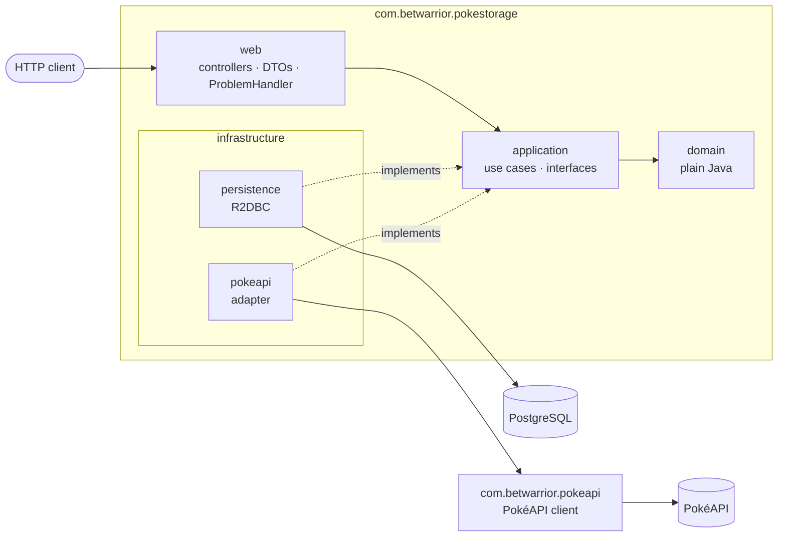
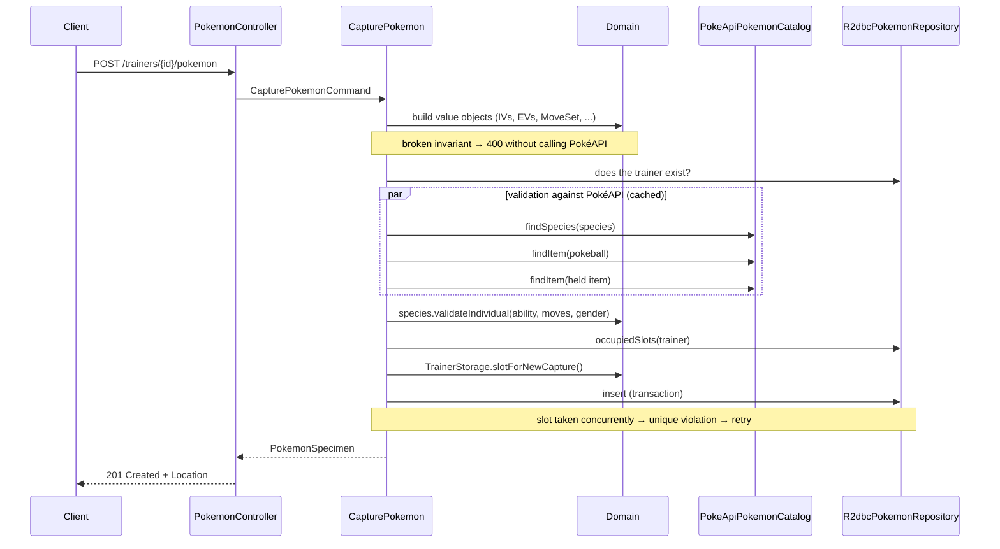

# pokemon-trainer-service

Service that manages **each trainer's individual Pokémon**, separating the **Active Team** from the **PC Box**. It is built on top of the inherited [`pokeapi-reactor`](https://github.com/SirSkaro/pokeapi-reactor) project, a reactive client for [PokéAPI](https://pokeapi.co/), which has since been replaced by a declarative client ([`com.betwarrior.pokeapi`](#pokéapi-client)).

> Solution to the *"Pokémon Box and Active Team"* technical challenge. This README replaces the library's original one: it describes what was built, why, and how to use and maintain the project. The library's original documentation is summarized in [The inherited library](#the-inherited-library-pokeapi-reactor).

## Contents

- [What it does](#what-it-does)
- [How to run it](#how-to-run-it)
- [API](#api)
- [Architecture](#architecture)
- [Domain model and rules](#domain-model-and-rules)
- [Persistence](#persistence)
- [PokéAPI client](#pokéapi-client)
- [Decisions and alternatives](#decisions-and-alternatives)
- [Changes and findings in the inherited library](#changes-and-findings-in-the-inherited-library)
- [Tests](#tests)
- [Maintenance guide](#maintenance-guide)
- [Proposed evolution](#proposed-evolution)
- [Tools used](#tools-used)

---

## What it does

- **Capture** Pokémon with their individual data: IVs, EVs, nature, ability, gender, shiny, moves, held item and origin data. Each specimen is validated against PokéAPI and **automatically** placed in the first free team slot or, if the team is full, in the box.
- **Detail** of a specimen with all its technical, genetic and origin metadata.
- **Active team** as a **composite view**: the specimen's data is combined with the species data from PokéAPI (types, base stats, sprite) and with the **stats calculated** using the games' official formula.
- Paginated **box**.
- Paginated listings of **all trainers** and **all Pokémon**, across trainers, as utility endpoints.
- **Transfer** between team and box, with capacity validation.
- **Evolution** (bonus): validates that the target species is a **direct** evolution, including branched lines such as Eevee. It reassigns the ability and preserves identity, genetics, held item, history and **the exact slot** in the team.

## How to run it

Requirements: **Java 21**, **Maven 3.9+** and **Docker** (for Postgres and the integration tests).

```bash
docker compose up -d                 # Postgres 16 on localhost:5432
mvn spring-boot:run                  # the app on http://localhost:8080
```

| Resource | URL |
|---|---|
| Swagger UI | http://localhost:8080/swagger-ui.html |
| OpenAPI (JSON) | http://localhost:8080/v3/api-docs |
| Health | http://localhost:8080/actuator/health |

Flyway creates the schema on startup. Configuration lives in [`application.yml`](src/main/resources/application.yml) and can be overridden with environment variables:

| Variable / property | Default | Description |
|---|---|---|
| `DB_R2DBC_URL` | `r2dbc:postgresql://localhost:5432/pokestorage` | The app's reactive connection |
| `DB_JDBC_URL` | `jdbc:postgresql://localhost:5432/pokestorage` | JDBC connection, used only for Flyway migrations |
| `DB_USER` / `DB_PASSWORD` | `pokestorage` | Credentials |
| `POKEAPI_BASE_URL` | `https://pokeapi.co/api/v2` | PokéAPI instance |
| `pokestorage.storage.team-capacity` | `6` | Maximum Pokémon in the active team |
| `pokestorage.storage.box-capacity` | `30` | Maximum Pokémon in the box |
| `pokeapi.*` | see [PokéAPI client](#pokéapi-client) | Timeouts, retries and body size towards PokéAPI |
| `spring.cache.caffeine.spec` | `maximumSize=2000,expireAfterWrite=24h` | Cache of PokéAPI resources |

## API

Base path: `/api/v1`. All errors follow **RFC 7807** (`application/problem+json`) and include a stable `code`, so clients don't need to parse messages.

The full contract is published as **OpenAPI 3.1** and browsable in **Swagger UI** (`/swagger-ui.html`): every endpoint documents its request fields (with limits and examples), its responses and each error it can return, with an example per `code`. The document is built from annotations on the controllers and payloads, plus [`OpenApiConfiguration`](src/main/java/com/betwarrior/pokestorage/web/openapi/OpenApiConfiguration.java), which holds the API metadata and the reusable error responses.

| Method | Path | Description | Success |
|---|---|---|---|
| `POST` | `/trainers` | Register a trainer | `201` + `Location` |
| `GET` | `/trainers?page=0&size=20` | List all trainers, in registration order (paginated) | `200` |
| `GET` | `/trainers/{trainerId}` | Get a trainer | `200` |
| `GET` | `/pokemon?page=0&size=20` | List every stored Pokémon of all trainers, in storage order (paginated) | `200` |
| `POST` | `/trainers/{trainerId}/pokemon` | Capture / create a specimen (goes to the team or the box) | `201` + `Location` |
| `GET` | `/trainers/{trainerId}/pokemon/{pokemonId}` | Specimen detail | `200` |
| `GET` | `/trainers/{trainerId}/team` | Active team (composite view with PokéAPI) | `200` |
| `GET` | `/trainers/{trainerId}/box?page=0&size=30` | Paginated box | `200` |
| `PUT` | `/trainers/{trainerId}/pokemon/{pokemonId}/storage` | Move between `TEAM` and `BOX` (idempotent) | `200` |
| `POST` | `/trainers/{trainerId}/pokemon/{pokemonId}/evolution` | Evolve a team member | `200` |

### Errors

| HTTP | `code` | When |
|---|---|---|
| 400 | `invalid-value` | An invariant is broken: IV outside 0–31, EV > 252 or total > 510, more than 4 moves, level outside 1–100, page < 0 or size outside 1–100, etc. |
| 400 | *(Spring)* | Malformed JSON, missing required field, invalid enum or UUID |
| 404 | `not-found` | Trainer or specimen doesn't exist (or belongs to another trainer) |
| 409 | `storage-full` | Team or box is full (`area` says which) |
| 409 | `pokemon-not-in-team` | Trying to evolve a Pokémon that is in the box |
| 409 | `concurrent-modification` | Extreme contention on the same slot; safe to retry |
| 422 | `species-rule-violation` | Ability, move or gender incompatible with the species. Includes `violations` with **all** the infractions |
| 422 | `unknown-pokeapi-entry` | Species or item doesn't exist in PokéAPI |
| 422 | `invalid-item` | The given Poké Ball is not a Poké Ball |
| 422 | `evolution-not-allowed` | The target species is not a direct evolution |
| 503 | `pokeapi-unavailable` | PokéAPI doesn't respond (after retries) |

### Examples

```bash
# Register a trainer
curl -s -X POST localhost:8080/api/v1/trainers -H 'Content-Type: application/json' -d '{"name":"Ash"}'

# Capture a Pikachu
curl -s -X POST localhost:8080/api/v1/trainers/$TRAINER/pokemon -H 'Content-Type: application/json' -d '{
  "species": "pikachu",
  "nickname": "Sparky",
  "level": 25,
  "individualValues": {"hp":31,"attack":31,"defense":31,"specialAttack":31,"specialDefense":31,"speed":31},
  "effortValues":     {"hp":4,"attack":0,"defense":0,"specialAttack":252,"specialDefense":0,"speed":252},
  "nature": "TIMID",
  "ability": "static",
  "gender": "FEMALE",
  "shiny": true,
  "moves": ["thunderbolt", "quick-attack"],
  "heldItem": "light-ball",
  "origin": {"pokeball": "poke-ball", "location": "viridian-forest"}
}'
```

Optional fields: `nickname`, `effortValues` (default: all 0), `heldItem`, `origin.originalTrainerId` (default: the capturing trainer), `origin.caughtAt` (default: now). The capture level is recorded as `origin.metLevel`.

```bash
# Active team (composite view)
curl -s localhost:8080/api/v1/trainers/$TRAINER/team
# {"capacity":6,"members":[{"slot":1,
#    "pokemon":{...specimen detail...},
#    "species":{"id":25,"name":"pikachu","types":["electric"],"baseStats":{...},"spriteUrl":"..."},
#    "stats":{"hp":60,"attack":36,"defense":32,"specialAttack":53,"specialDefense":37,"speed":80}}]}

# Every trainer / every Pokémon, page by page
curl -s 'localhost:8080/api/v1/trainers?page=0&size=20'
curl -s 'localhost:8080/api/v1/pokemon?page=0&size=20'
# {"pokemon":[{...specimen detail with trainerId and storage...}],"page":0,"size":20,"totalElements":42,"totalPages":3}

# Deposit into the box / withdraw to the team
curl -s -X PUT localhost:8080/api/v1/trainers/$TRAINER/pokemon/$POKEMON/storage -H 'Content-Type: application/json' -d '{"area":"BOX"}'

# Evolve (ability is optional)
curl -s -X POST localhost:8080/api/v1/trainers/$TRAINER/pokemon/$POKEMON/evolution -H 'Content-Type: application/json' -d '{"targetSpecies":"gyarados"}'
```

Species, ability, move and item names are PokéAPI's (lowercase, hyphenated). Input is normalized: `"Pikachu"` is equivalent to `"pikachu"`.

## Architecture

A modular monolith in a **single Maven module**, organized in layers whose dependencies **only point inwards**. [ArchUnit](src/test/java/com/betwarrior/pokestorage/architecture/ArchitectureTest.java) checks those rules on every build: if someone breaks them, the build fails.



| Package | Responsibility | May depend on |
|---|---|---|
| `domain` | Business rules: value objects, specimen, storage, species, evolution, stat formula | nothing (no Spring, Reactor or the library) |
| `application` | Use cases (`usecase`: `CapturePokemon`, `ListTeam`, `TransferPokemon`, `EvolvePokemon`, …) and the interfaces they need (`port`: `PokemonRepository`, `TrainerRepository`, `PokemonCatalog`) | `domain` |
| `infrastructure.persistence` | R2DBC implementation of the repositories | `application`, `domain` |
| `infrastructure.pokeapi` | `PokeApiPokemonCatalog`: translates PokéAPI records into the domain | `application`, `domain`, PokéAPI client |
| `web` | HTTP: controllers, payloads, format validation, error mapping and OpenAPI documentation | `application`, `domain` |
| `com.betwarrior.pokeapi` | Declarative PokéAPI client and its records | only used by `infrastructure.pokeapi`; it never depends on the service |

Inside each layer, classes are grouped by role or concept, so no layer is a flat list of files:

```text
com.betwarrior.pokestorage
├── domain
│   ├── pokemon        PokemonSpecimen, PokemonId, Level, MoveSet, Gender, CaptureOrigin
│   ├── stats          Stat, StatValues, IndividualValues, EffortValues, Nature, StatCalculator
│   ├── species        Species, SpeciesRef, SpeciesAbility, GenderRatio
│   ├── storage        StorageArea, StorageSlot, StorageCapacity, TrainerStorage
│   ├── trainer        Trainer, TrainerId
│   └── exception      DomainException and its subclasses
├── application
│   ├── usecase
│   │   ├── trainer    RegisterTrainer, FindTrainer, ListTrainers
│   │   ├── pokemon    CapturePokemon, FindPokemon, EvolvePokemon, ListAllPokemon
│   │   └── storage    ListTeam, ListBox, TransferPokemon, SlotRetry
│   ├── port           PokemonRepository, TrainerRepository, PokemonCatalog
│   ├── pagination     PageRequest (validates page and size), Page<T>
│   ├── exception      ApplicationException and its subclasses
│   └── config         StorageProperties, ApplicationConfiguration
├── infrastructure
│   ├── persistence    R2dbcPokemonRepository, R2dbcTrainerRepository
│   └── pokeapi        PokeApiPokemonCatalog, PokeApiCachingConfiguration
└── web
    ├── controller     TrainerController, PokemonController, AllPokemonController
    ├── dto            Request/response payloads
    ├── error          ProblemHandler (RFC 7807)
    └── openapi        OpenApiConfiguration, ApiProblem
```

Tests mirror the same packages.

**Why this style.** PokéAPI's model is *snake_case*, huge and designed for the games, not for this business. The domain doesn't know about it: if tomorrow it is replaced by another client, or by a local copy of the data, only `infrastructure.pokeapi` changes. Also, each layer has a clear responsibility, which makes onboarding new people easier.

### Capture flow



## Domain model and rules

| Concept | Class | Rule |
|---|---|---|
| Specimen | `PokemonSpecimen` | Immutable; identity given by `PokemonId` (UUID) |
| Individual Values | `IndividualValues` | 6 stats, each between **0 and 31** |
| Effort Values | `EffortValues` | Each stat between **0 and 252**, total **≤ 510** |
| Nature | `Nature` | All **25**, each with the stat it raises and the one it lowers by 10%. The 5 neutral ones change nothing and HP is never affected |
| Ability | `Species.validateIndividual` | Must be one the species has in PokéAPI (hidden ones included) |
| Moves | `MoveSet` | Between **1 and 4**, no duplicates, and learnable by the species according to PokéAPI |
| Gender | `Gender` + `GenderRatio` | `MALE` / `FEMALE` / `GENDERLESS`, compatible with the species' `gender_rate`: genderless → only `GENDERLESS`; 100% male → only `MALE`; etc. |
| Shiny | `shiny` | Flag |
| Origin | `CaptureOrigin` | OT, Poké Ball (must belong to a `*-balls` category in PokéAPI), date, met level and location |
| Held item | `heldItem` | At most one; must exist in PokéAPI |
| Storage | `TrainerStorage` + `StorageSlot` | Capture: first free team slot, otherwise box, otherwise `409`. Slots are **not compacted**: a Pokémon keeps its exact position |
| Calculated stats | `StatCalculator` | Official formula (Gen III+), validated against the reference example of a level 78 Garchomp |
| Evolution | `PokemonSpecimen.evolveInto` | Team only; target = **direct** evolution; everything is preserved except species and ability |

**Interpreting the statement.** The PDF says stats "start from 1" and that "genetic values" from 0 to 31 are added to them. I modeled it as in the games: the **base stats** (≥ 1) come from PokéAPI per species, and the **IVs** (0–31) are each specimen's own genetics. The final stat combines base, IVs, EVs, level and nature, and is exposed in the team view.

### Evolution

- **Direct-line validation:** a target species is valid if its `evolves_from_species` in PokéAPI is the current species. That covers simple lines (Bulbasaur → Ivysaur → Venusaur, without skipping stages) and branched ones (Eevee → Vaporeon, Jolteon, …), with a single resource per species and without walking the `EvolutionChain` tree.
- **Ability:** if the request specifies one, it must belong to the target species. Otherwise the **same ability slot** is kept (a hidden ability becomes the evolution's hidden ability) and, if that slot doesn't exist, the first non-hidden one is used. Example: Magikarp *swift-swim* (slot 1) → Gyarados *intimidate* (slot 1).
- Situational requirements (level, items, friendship) are not validated, as the statement indicates.

## Persistence

PostgreSQL 16 with **reactive (R2DBC)** access, consistent with WebFlux and with the library. The schema is versioned with **Flyway** in [`V1__create_trainer_storage.sql`](src/main/resources/db/migration/V1__create_trainer_storage.sql).

- Two tables: `trainer` and `pokemon`. The specimen's attributes are **flat columns** (`iv_hp`, `ev_speed`, `nature`, …), queryable and indexable. Moves are stored in a `varchar[]`.
- **The database also protects the invariants** with `CHECK` constraints (IV/EV ranges, EV total ≤ 510, 1–4 moves, level 1–100), in case someone writes outside the app.
- **Concurrency:** `UNIQUE (trainer_id, storage_area, storage_slot)`. If two simultaneous captures pick the same free slot, the database rejects one; the application retries it after re-reading the storage. Since the domain only assigns slots between 1 and the capacity, **the limit is never exceeded**. An integration test fires 20 concurrent captures against a limit of 8.
- Repositories use `DatabaseClient` with explicit SQL, without Spring Data: the mapping is visible and there is no magic.

## PokéAPI client

`com.betwarrior.pokeapi` replaces the inherited `skaro.pokeapi` library ([ADR 0002](docs/adr/0002-pokeapi-client-v2.md)). It is a **Spring HTTP interface**: one method per PokéAPI endpoint, implemented by Spring on top of `WebClient`.

```java
@Autowired PokeApi pokeApi;

pokeApi.pokemon("pikachu");                        // Mono<Pokemon>, by name or id
pokeApi.pokemonSpecies("eevee")
       .flatMap(species -> pokeApi.pokemon(species.defaultVariety().name()));
pokeApi.evolutionChain(1);                          // resources without a name are fetched by id
pokeApi.list("pokemon", 0, 20);                     // Mono<Page<NamedRef<Object>>>, any listing
```

```text
com.betwarrior.pokeapi
├── PokeApi                    @HttpExchange interface, one method per endpoint
├── PokeApiAutoConfiguration   the PokeApi bean, error filter, cache key generator
├── PokeApiProperties          pokeapi.* settings
├── PokeApiJson                snake_case mapping, private to the client
├── Page                       one page of a listing
├── error                      sealed PokeApiException: ResourceNotFound, PokeApiUnavailable, UnexpectedResponse
├── ref                        NamedRef / ApiRef: links between resources, with id()
└── model                      immutable records grouped like the PokéAPI docs
    ├── pokemon · species · evolution · abilities · moves · items · berries
    └── encounters · games · locations · contests · machines · utility
```

- **Any Pokémon, item or move is reachable without code changes.** Only a new *kind* of resource needs code: a record in `model` and one method in `PokeApi`. `PokeApiEndpointsTest` fails if a resource record has no method, and it deserializes a real response for every endpoint.
- **Records with behavior:**
  - Lists are never `null` and cannot be modified.
  - `PokemonSpecies.defaultVariety()` makes species like `deoxys` resolve to `deoxys-normal`; `evolvesFrom()` gives the previous stage.
  - `Pokemon.baseStats()`, `moveNames()`, `learns(move)`, `typeNames()` and `frontSprite()` cover the usual lookups.
  - `Localized.nameIn(language)` returns the name in a given language.
- **Errors:** `PokeApiException` is sealed, so it can be handled exhaustively with a `switch`.
  - 404 → `ResourceNotFoundException`, never retried.
  - 5xx, 429, timeouts and connection errors → retried with backoff, then `PokeApiUnavailableException`.
  - Anything else → `UnexpectedResponseException`.
- **Cache:** `@Cacheable` per endpoint (`pokeapi.pokemon`, `pokeapi.item`, …), active when the application enables caching. This service does it in `PokeApiCachingConfiguration`, backed by Caffeine (24 h, 2000 entries).
  - Names are case-insensitive keys.
  - Failures are never cached.
  - The client switches Caffeine to async mode, which Spring needs to cache `Mono`.

| Property | Default | Description |
|---|---|---|
| `pokeapi.base-url` | `https://pokeapi.co/api/v2` | PokéAPI root (a mirror, or a stub in tests) |
| `pokeapi.connect-timeout` / `response-timeout` | `2s` / `5s` | HTTP timeouts |
| `pokeapi.max-response-size` | `10MB` | Largest body accepted (`/pokemon/mew` is ~670 KB) |
| `pokeapi.retry.max-retries` / `first-backoff` | `2` / `200ms` | Retries on transient failures |

Outside Spring Boot, `PokeApiAutoConfiguration.createClient(WebClient.builder(), properties)` builds the client directly.

**How the service uses it.** `PokeApiPokemonCatalog` makes these calls:
- `pokemonSpecies(name)`, then `pokemon(defaultVariety)`, translated into the domain's `Species`.
- `item(name)` to validate Poké Balls and held items.

`ResourceNotFoundException` becomes "doesn't exist" (422), and any other failure becomes `503`.

## Decisions and alternatives

| Decision | Alternatives considered | Why |
|---|---|---|
| Spring Boot 3.5 + Java 17 ([ADR 0001](docs/adr/0001-migrate-to-spring-boot-3.md)), then Java 21 | Stay on 2.4.3; 2.7; 4.1 | 2.x is unsupported. 4.1 means Jackson 3, which the library relies on heavily. 3.5 brings `jakarta` and `ProblemDetail` with limited risk. Java 21 is the current LTS |
| Declarative PokéAPI client on Spring HTTP interfaces ([ADR 0002](docs/adr/0002-pokeapi-client-v2.md)) | Fix `skaro.pokeapi` in place; framework-free client; generate from PokéAPI's OpenAPI spec | Spring already provides the HTTP client, caching and configuration, so the client is an interface plus records. No endpoint registry or `Class` arguments |
| Single module with layers + ArchUnit | Maven multi-module; JPMS | Less ceremony. ArchUnit gives a guarantee similar to separate modules |
| WebFlux + R2DBC | Spring MVC + JPA | The library is reactive; mixing blocking and reactive models adds complexity and the risk of blocking the event loop |
| Flat columns | JSONB with all the genetics | Invariants are also enforced in the database (`CHECK`) and the data is queryable. JSONB is more flexible but opaque |
| Unique constraint for concurrency | Optimistic lock (`version`) on the trainer; `SELECT … FOR UPDATE` | No extra state and no long-held locks; conflicts only happen when there is an actual race |
| Fixed slots (no compaction) | Reorder the team when a Pokémon leaves | The bonus requires preserving the "exact slot" |
| Validate evolution with `evolves_from_species` | Walk the `EvolutionChain` | Simpler: 1 resource per species, already cached by the capture. (The inherited library couldn't even request `EvolutionChain`; the new client can) |
| Team composition in the backend | Let the client call PokéAPI | The statement asks for a composite view; it also centralizes caching and resilience |
| If PokéAPI is down, `GET /team` returns `503` | Degrade: return the team without species data | Simple, explicit contract. Degradation is a possible improvement (see evolution) |
| RFC 7807 errors with `code` | Custom format | Standard, natively supported by Spring 6 |
| IVs required, EVs optional | Everything optional with random defaults | IVs define the individual; a freshly caught Pokémon has no training (EVs at 0) |
| Lombok only for injection constructors and loggers | Lombok everywhere (`@Data`, `@Value`, `@Builder`); no Lombok | Domain objects and payloads are Java `record`s, which already remove the boilerplate Lombok is usually added for. Lombok removes what records can't: constructors that only assign dependencies and logger fields. The domain stays free of it |
| Authorization not implemented | JWT per trainer | Out of scope; left for the proposed evolution |

## Changes and findings in the inherited library

While solving the challenge, the criterion was: **only what the upgrade required or what blocked the feature was modified.** Everything else was documented. The library has since been **replaced and deleted**; every finding below is fixed in the new client ([ADR 0002](docs/adr/0002-pokeapi-client-v2.md)). The tables are kept as a record of why.

### Modified

| Change | Reason |
|---|---|
| `javax.validation` → `jakarta.validation` | Upgrade to Boot 3 |
| `CacheMono` replaced in `ReactiveCacheManagerCacheFacade` | Class removed in reactor-extra 3.5. As a side effect, **errors are no longer cached**: before, a momentary PokéAPI outage stayed in the cache |
| `PropertyNamingStrategy.SNAKE_CASE` → `PropertyNamingStrategies.SNAKE_CASE` | Removed in Jackson 2.13+ |
| **`Item.category` was a list, but PokéAPI returns an object** | **No `Item` could be deserialized**, and the feature needs to validate the Poké Ball and the held item. Regression test with a real response |

### Detected, not modified

| # | Finding | Impact | Possible fix |
|---|---|---|---|
| 1 | `ReactiveCachingPokeApiClient` caches every listing (`getResource(Class)` and paginated ones) in the `NamedApiResourceList` cache under the key `"collection"`, **regardless of type** | Listing abilities after listing Pokémon returns the Pokémon list | Include the resource class in the key or in the cache name |
| 2 | The `Region` endpoint is registered as `pokemon-region`; the correct one is `region` | `getResource(Region.class, …)` always fails (PokéAPI responds 400) | Fix the mapping in `PokeApiReactorEndpointConfiguration` |
| 3 | `EvolutionChain` doesn't implement `PokeApiResource` | It can't be requested with the client: the generics prevent it | Implement the interface (`getName()` → `null`) |
| 4 | The original README documents the property `skaro.pokeapi.max-buffer-size`, but the real one is `max-bytes-to-buffer` | The documented setting is silently ignored | Fix the documentation or add an alias |
| 5 | The default buffer (565 KB) is smaller than the `/pokemon/mew` response (~670 KB) | Deserialization error on Pokémon with many moves | Raise the default. This service sets it to 10 MB |
| 6 | Fields that don't match PokéAPI's JSON: `BerryFlavor.barries`, `ContestComboDetail.userBefore`/`userAfter`, `LocationArea.Id`/`encoutnerMethodRates`, `EvolutionChain.item` (really `baby_trigger_item`), `Item.cost` (now `prices`) | That data is silently `null` | Found by comparing every record with a real response while writing the new client |

In addition, Spring Boot 2.4, reactor-extra and the `adopt` Java distribution were discontinued. The upgrade solved all of that.

## Tests

```bash
mvn test      # unit: domain, use cases, PokéAPI client and adapter, ArchUnit (no Docker needed)
mvn verify    # + integration with a real Postgres (Testcontainers) and the full app (needs Docker)
```

| Level | What it covers | How |
|---|---|---|
| Domain | Invariants, natures, storage, species rules, evolution, stat formula | JUnit 5 + AssertJ, no mocks |
| Use cases | Orchestration, errors, retry on slot conflicts | In-memory repositories and catalog (`testsupport`) |
| PokéAPI client | Every endpoint maps a real response; errors, retries, caching | `MockWebServer` with trimmed **real** responses, one per endpoint ([`src/test/resources/pokeapi-v2`](src/test/resources/pokeapi-v2)) + `ApplicationContextRunner` |
| PokéAPI adapter | Translation into the domain, 404, unavailability | `MockWebServer` with trimmed **real** PokéAPI responses ([`src/test/resources/pokeapi`](src/test/resources/pokeapi)) |
| Persistence (`*IT`) | Full mapping, slot constraint, pagination | `@DataR2dbcTest` + Testcontainers Postgres |
| API (`*IT`) | All endpoints, error codes, concurrent captures | `@SpringBootTest` + Testcontainers + PokéAPI stub |
| API docs (`*IT`) | The OpenAPI document exposes every endpoint, example and error response | `@SpringBootTest` + `/v3/api-docs` |
| Architecture | Dependencies between layers; the client doesn't know the service | ArchUnit |

Convention: tests follow a **BDD style without Gherkin**. The method name describes the scenario (`givenX_whenY_thenZ`) and phases are separated by blank lines, without comments.

## Maintenance guide

- **Adding a business rule:** it goes in `domain`, in the concept package and object that own the data. For example, a rule about moves goes in `MoveSet` or `Species`. It is tested without Spring.
- **Adding an endpoint:** use case in `application.usecase.<feature>` (one class per use case) → controller method in `web.controller` → payload in `web.dto`. Document it with `@Operation`, `@Schema` on the payload fields and `@ApiResponse(ref = ...)` for its errors. If a new error appears, add the exception to the layer's `exception` package, map it in `ProblemHandler` with a new `code` and add its example to `OpenApiConfiguration`.
- **Changing the schema:** new migration `V{n}__description.sql`. Already-applied migrations are never edited.
- **New PokéAPI data for the service:** add it to `Species` and map it in `PokeApiPokemonCatalog`. For tests, add a trimmed fixture to `src/test/resources/pokeapi/` named `{resource}-{name}.json`.
- **A new kind of PokéAPI resource:** add its record to `com.betwarrior.pokeapi.model.<group>`, a method to `PokeApi` and a real, trimmed response to `src/test/resources/pokeapi-v2/{endpoint}.json`. `PokeApiEndpointsTest` checks both.
- **Architecture decisions:** recorded as ADRs in [`docs/adr`](docs/adr).
- **CI:** [`.github/workflows/ci.yml`](.github/workflows/ci.yml) runs `mvn verify` on every push and PR.

## Proposed evolution

1. **Spring Boot 4.x**: 3.5 no longer has OSS support. It requires migrating the library to Jackson 3 (see ADR 0001).
2. **Authentication and authorization** per trainer (OAuth2/JWT): today anyone with the ID can operate on any trainer.
3. **Extract `com.betwarrior.pokeapi`** into its own module or repository with semantic versioning if another service needs it.
4. **Graceful degradation** of `GET /team` when PokéAPI doesn't respond: return the specimen data with `species: null` and a warning.
5. **Distributed cache** (Redis) if the service scales horizontally, or a **local PokéAPI replica** (it's open source) to avoid depending on a rate-limited public service.
6. **Observability:** Micrometer metrics (PokéAPI latency, cache hit ratio, slot conflicts) and tracing.
7. **Domain events** (`PokemonCaptured`, `PokemonEvolved`) with an outbox, if other services need to know.
8. **Multiple PC boxes** (Box 1..N), as in the games: `StorageSlot` already models area + position and would be extended with a box number.
9. Missing operations: release a Pokémon, change the held item, reorder the team (slot swap), level up or train EVs.

## Tools used

- **Java 21**, **Spring Boot 3.5** (WebFlux, Data R2DBC, Validation, Cache, Actuator), **Project Reactor**
- **PostgreSQL 16**, **R2DBC**, **Flyway**
- **Caffeine** (cache), **springdoc-openapi** (Swagger UI)
- **Lombok**, only for constructor injection (`@RequiredArgsConstructor`) and logging (`@Slf4j`)
- **JUnit 5**, **AssertJ**, **Mockito (BDDMockito)**, **Reactor Test**, **Testcontainers**, **OkHttp MockWebServer**, **ArchUnit**, **JaCoCo**
- **Docker Compose**, **GitHub Actions**
- **Claude Code** as an AI assistant during design, implementation and review

---

## The inherited library: pokeapi-reactor

A non-blocking, caching PokéAPI client, originally published as a library by [SirSkaro](https://github.com/SirSkaro/pokeapi-reactor) (package `skaro.pokeapi`). This project started from it, kept its commit history, and replaced it with [`com.betwarrior.pokeapi`](#pokéapi-client). The old code was then deleted ([ADR 0002](docs/adr/0002-pokeapi-client-v2.md)); it can still be browsed in git history.

MIT license (see [LICENSE](LICENSE)).
